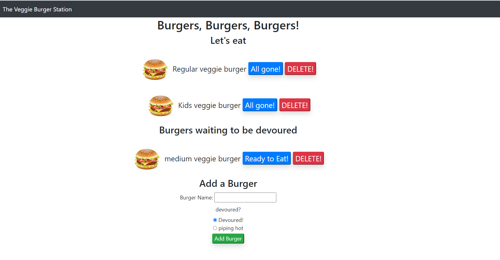

# MVC Veggie Burger Station 
[](https://opensource.org/licenses/MIT)


MVC Veggie burger application using Express, Handlebars, and MySQL
## Table of contents
* [General info](#general-info)
* [Technologies](#technologies)
* [Install](#install)

## General info
This is a burger application fillwong a Model View Controller pattern that allows users to denote the burgers they have eaten, add then back to the list of avaliable burgers, delete burgers, and create new burger that are avaliable to eat or already devoured.  
	
## Technologies
Project is created with:
* Javascript
* Node.js 
* Express.js
* Express-handlebars.js
* MySQL

## Install
Download the repository. Make sure you have node.js installed. Open your terminal and run
``` npm install ```
Open your MySQL Workbench and run the 'schema.sql' and the 'seeds'sql' file located in the 'db' folder.
Open the 'connection.js' file in the 'config' folder and change the password. 

To run the application
``` node server.js ```

